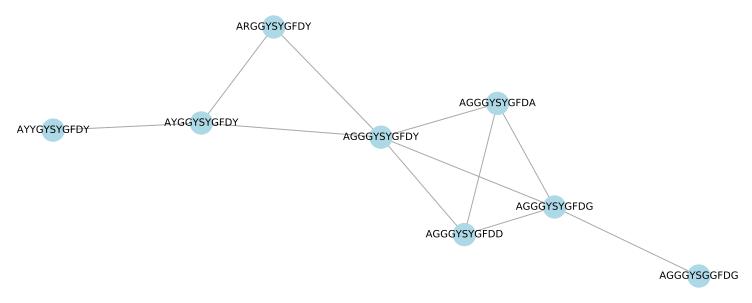

# Strsim network

[](https://travis-ci.com/dweb0/strsim-network)
[](https://ci.appveyor.com/project/dweb0/strsim-network)
[](https://github.com/dweb0/strsim-network/releases)
[](https://github.com/dweb0/strsim-network/blob/master/LICENSE-APACHE)

Command line tool for creating a network based on string similarity (undirected, non-multigraph).

## Supported algorithms

- levenshtein
- normalized levenshtein
- hamming
- jaro
- jaro winkler
- damerau levenshtein
- normalized damerau levenshtein
- osa distance

See https://docs.rs/strsim/0.9.3/strsim/ for reference.

## Features

- Parallel execution
- Progress bar
- Save to GML, node-link json (useful for `d3.js`), or CSR matrix

## Use cases

- Nucleotide or peptide clustering

For example, lets say you have the following peptides:

``` 
ARGGYSYGFDY
AYGGYSYGFDY
AYYGYSYGFDY
AGGGYSYGFDY
AGGGYSYGFDD
AGGGYSYGFDG
AGGGYSYGFDA
AGGGYSGGFDG
```

Lets create a graph, where each link must have a levenshtein distance of 1.

```bash
strsim-network my_strings.txt -a levenshtein -m 1 -M 1 > output.gml
```



> Created with networkx python library

## Installation

Via [cargo](https://www.rust-lang.org/tools/install)

```bash
cargo install --git https://github.com/dweb0/strsim-network --features cli
```

**[Pre-built binaries for Mac, Windows, and Linux here.](https://github.com/dweb0/strsim-network/releases)**

## More examples

Create a graph of all pairs of strings with a jaro winkler distance >= 0.8 and <= 1.0.

```bash
strsim-network my_strings.txt -a jaro_winkler -m 0.8 -M 1.0
```

## Developers

This crate is setup as both a library and a command line tool. You can use the library
by adding the following to your `Cargo.toml`.

```toml
[dependencies]
strsim-network = { git = "https://github.com/dweb0/strsim-network" }
```

To create a coordinate matrix, you need to provide a function, and a min
and max allowed range to be considered a link.

```rust
use strsim_network::CooMatrix;
use strsim::levenshtein;

fn main() {
    let strings = vec!["AA", "AB", "XX", "XY", "YY", "QQ"];
    let matrix = CooMatrix::from_strings(&strings, 1, 1, &levenshtein);
    
    // Convert this matrix into a graph, labeling each node from the strings
    let graph = matrix.into_graph(&strings);
    graph.to_gml_pretty(std::io::stdout()).unwrap();
}
```

Note that `min_dist` and `max_dist` and the return type of the `distance_func` supplied must be of the same type.
